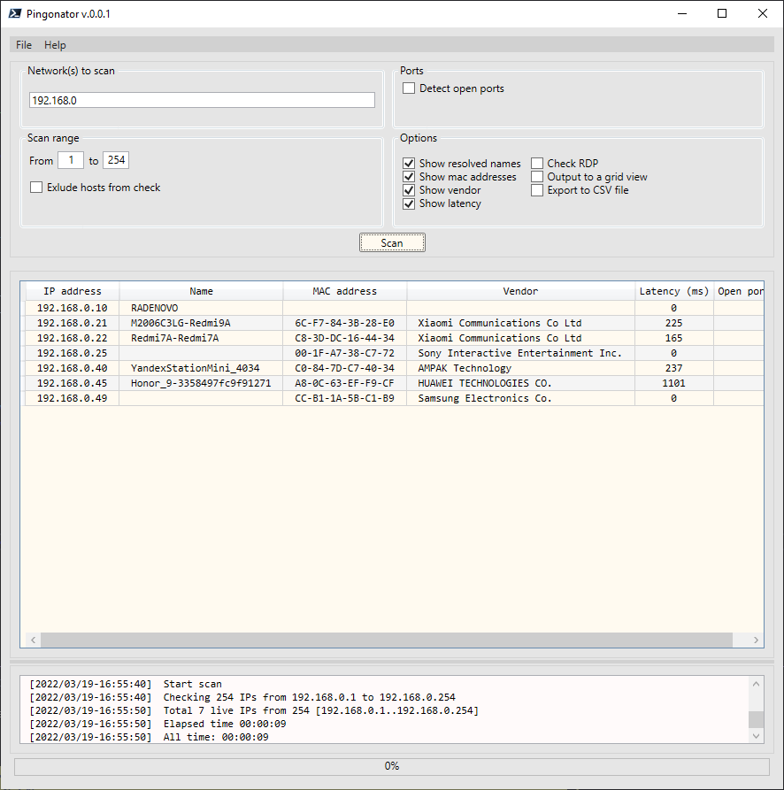

# PingonatorGUI

## Parallel network check

*fast and furious*

GUI version of [Pingonator](https://github.com/killadog/Pingonator)

## Prepare your own oui.txt
If you want to have the newest OUI list follow the [instructions](https://github.com/killadog/hatools#oui-macro-for-notepad).
